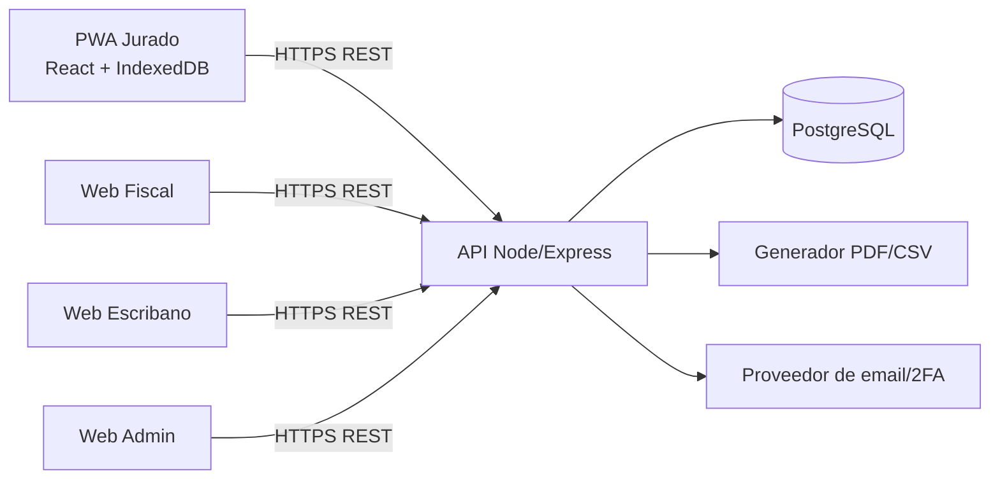

# 03 — Arquitectura Técnica del Sistema

**Proyecto:** Carnavales 2027  
**Estado:** Base de desarrollo  
**Versión:** 1.0

## 1. Objetivo
Definir una arquitectura consistente para una PWA de votación conectada normalmente a Internet pero resiliente a cortes en el corsódromo.

## 2. Stack base
- **Frontend:** React + TypeScript.
- **PWA:** Service Worker + Web App Manifest.
- **Persistencia local:** IndexedDB.
- **Backend:** Node.js + Express + TypeScript.
- **Base de datos:** PostgreSQL.
- **API:** REST/JSON sobre HTTPS.
- **Documentos:** generación server-side de PDF/CSV.

## 3. Principios
1. El servidor es la fuente de verdad oficial.
2. Cada voto se persiste localmente antes del intento de red.
3. Toda escritura crítica usa `operation_uuid` para idempotencia.
4. Los votos confirmados son append-only/inmutables.
5. Cálculos oficiales ocurren en servidor.
6. Toda excepción administrativa relevante genera auditoría.

## 4. Componentes

## 5. Resiliencia de voto
Estados locales recomendados:
- `LOCAL`: operación creada y persistida localmente.
- `PENDING`: pendiente de envío o reintento.
- `SYNCING`: intento en curso.
- `SYNCED`: servidor confirmó aceptación o idempotencia.
- `CONFLICT`: conflicto preservado para revisión.
- `REJECTED`: servidor rechazó por regla de negocio y debe mostrarse la causa.

El Service Worker/background sync puede ayudar, pero la app debe poseer además un reconciliador explícito al abrir, recuperar foco y detectar conectividad.

## 6. Autenticación
- Identidad centralizada en una tabla `users` con rol.
- El Jurado selecciona una noche creada luego de autenticarse; no requiere asignación administrativa previa.
- Validación primaria con `nombre + email + DNI` y OTP de 6 dígitos según Documento 8.
- Tokens/sesiones nunca se almacenan en texto plano en IndexedDB.
- Preferencia: sesión segura mediante cookie `HttpOnly`, `Secure`, `SameSite` cuando la topología lo permita.
- Entrega OTP: `OTP_DEV_LOG` solo para desarrollo local; correo real por Resend o SMTP según configuración.

## 7. Tiempo real
Para la primera versión, polling corto del Fiscal es aceptable. El contrato debe permitir migrar a SSE/WebSocket sin cambiar el modelo funcional.

## 8. Documentos oficiales
- El backend genera PDF/CSV desde una transacción/snapshot consistente.
- El hash SHA-256 y metadatos se persisten junto con el acta.
- Los archivos certificados se consideran inmutables.

## 9. Observabilidad
Mínimo:
- logs estructurados con `request_id` y `operation_uuid`;
- métricas de errores, latencia, votos pendientes/rechazados y sincronización;
- auditoría separada de logs operativos.

## 10. Despliegue
La arquitectura debe ser compatible con Vercel/Render u otro proveedor, pero no se fija proveedor en esta fase. Producción exige:
- HTTPS;
- PostgreSQL gestionado con backups;
- variables secretas fuera del repositorio;
- health checks;
- migraciones versionadas;
- rollback documentado.
