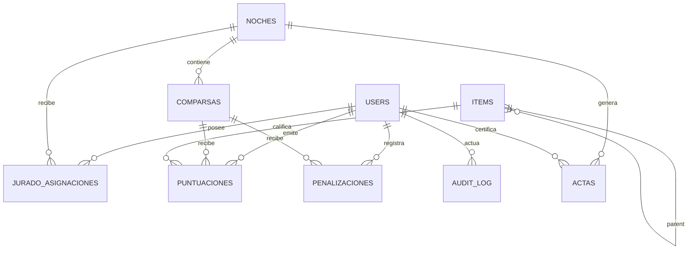

# 04 — Modelo de Datos / ERD

**Proyecto:** Carnavales 2027  
**Estado:** Base de desarrollo  
**Versión:** 1.0

## 1. Decisión principal
Se reemplaza la duplicación de identidad en `jurados`, `fiscales` y `escribanos` por una entidad central `users`. Los datos específicos de participación se modelan con asignaciones y relaciones. Esto simplifica autenticación, RBAC, baja lógica y auditoría.

## 2. ERD lógico

## 3. Entidades mínimas
### `users`
`id UUID PK`, `nombre`, `dni UNIQUE`, `email UNIQUE`, `role`, `activo`, timestamps.

Roles iniciales: `jurado`, `fiscal`, `escribano`, `admin`.

### `noches`
`id`, `nombre`, `fecha`, `estado` (`draft|open|closed|certified`), timestamps.

### `jurado_asignaciones`
Relaciona jurado+noche con vigencia cuando Administración necesita registrar asignaciones o reemplazos operativos auditables.
Campos: `id`, `jurado_id`, `noche_id`, `estado`, `asignado_at`, `finalizado_at`, `reemplaza_asignacion_id`, `motivo`.

Las asignaciones no son la única fuente para votar: el Jurado elige una noche creada y el backend valida el estado de esa noche.

### `comparsas`
`id`, `nombre`, `noche_id`, `orden`, `activo`, timestamps. `UNIQUE(noche_id, orden)`.

Las comparsas pertenecen a una noche y son administradas por CRUD. El borrado normal es baja lógica (`activo=false`) cuando hay historial; no se destruye evidencia asociada.

### `items`
`id`, `nombre`, `parent_item_id`, `orden`, `activo`, timestamps.

### `puntuaciones`
- `id UUID PK` o UUID server-side.
- `operation_uuid UUID UNIQUE` generado en cliente.
- `jurado_id FK users`.
- `comparsa_id`.
- `item_id`.
- `valor CHECK 0..5`.
- `client_created_at`.
- `server_received_at`.
- `UNIQUE(jurado_id, comparsa_id, item_id)`.

No debe permitirse `UPDATE` ni `DELETE` por el rol de aplicación.

### `cierres_comparsa`
Registra la finalización explícita por jurado+comparsa. Campos: `id`, `operation_uuid UNIQUE`, `jurado_id`, `comparsa_id`, timestamps.

### `penalizaciones`
Campos: `id UUID`, `comparsa_id`, `puntos`, `motivo_codigo/descripcion`, `registrada_por`, `estado`, `created_at`. Anulaciones vía estado/evento, no DELETE.

### `actas`
Campos: `id UUID`, `noche_id`, `version`, `tipo`, `storage_key`, `sha256`, `generada_at`, `certificada_por`, `certificada_at`, `estado`.

### `audit_log`
Append-only: `id BIGSERIAL`, `actor_user_id`, `accion`, `entidad`, `entidad_id`, `request_id`, `operation_uuid`, `before_hash`, `after_hash`, `metadata JSONB`, `created_at`.

### `eventos_fiscal`
Registro derivado/transaccional de cierres y eventos relevantes para polling.

## 4. Restricciones críticas
- FK y `NOT NULL` en todas las relaciones obligatorias.
- `CHECK(valor BETWEEN 0 AND 5)`.
- unicidad de voto por jurado/comparsa/item.
- unicidad de `operation_uuid`.
- no update/delete sobre votos y audit log para el rol de runtime.
- toda operación de voto/cierre debe usar una comparsa activa cuya noche exista y esté abierta; validar transaccionalmente.

## 5. Migraciones
El esquema debe mantenerse mediante migraciones versionadas. No editar producción manualmente ni usar el archivo SQL como único historial.
